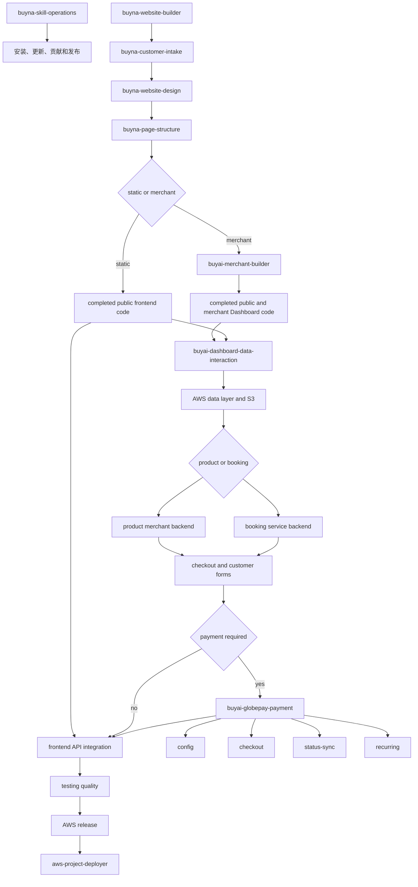

# Buyna.ai Agent Skills 操作手册

## 1. 手册目的

本仓库是 Buyna.ai 团队的 Codex Skill 单一来源。GitHub负责版本、权限、安装、审核和发布；Notion只负责索引、培训和业务说明。

任何人看到 Notion 页面或 GitHub 文件，不代表 Skill 已被 Codex 安装。只有完整文件夹进入个人 `.codex/skills/` 或项目 `.agents/skills/`，并重新开启 Codex 任务后，Skill 才能被发现。

## 2. 团队角色

| 角色 | GitHub权限 | 责任 |
| --- | --- | --- |
| Owner | Admin | 仓库、安全、成员和最终发布 |
| Maintainer | Maintain/Write | 审核 Skill、合并 PR、维护版本 |
| Developer | Write | 建分支、修改 Skill、提交 PR |
| User | Read | 下载、安装和调用 Skill |

当前仓库为 Public：任何人都可以读取和克隆；只有被授权成员可以直接推送。外部贡献者使用 Fork和 Pull Request。不要共享 GitHub账号。

## 3. 系统结构

详细目录职责和 Skill内部文件说明见 [文件夹分类与说明](FOLDER_GUIDE.md)。

```text
buyna-agent-skills/
├── README.md
├── CONTRIBUTING.md
├── SECURITY.md
├── docs/
│   ├── OPERATIONS_MANUAL.md
│   ├── WRITING_GUIDE.md
│   └── FOLDER_GUIDE.md
├── scripts/
│   ├── install.ps1
│   └── validate.ps1
├── packages/
│   ├── buyna-merchant-dashboard-core/       # fixed functions and state contracts
│   ├── buyna-merchant-dashboard-headless/   # fixed interactions, no visual theme
│   ├── buyna-checkout-flow-core/             # fixed checkout state behavior
│   ├── buyna-commerce-settlement-core/       # fixed trusted settlement state
│   ├── buyna-inventory-core/                 # fixed inventory reservations
│   ├── buyna-coupon-core/                    # fixed coupon lifecycle
│   ├── buyna-merchant-catalog-core/          # fixed catalog lifecycle
│   ├── buyna-auth-session-core/              # fixed trusted auth state
│   ├── buyna-merchant-context-core/           # fixed server-owned merchant scope
│   ├── buyna-cart-core/
│   ├── buyna-order-core/
│   ├── buyna-postgres-merchant-core/
│   └── buyna-merchant-file-core/
├── .github/
│   ├── CODEOWNERS
│   ├── ISSUE_TEMPLATE/
│   ├── PULL_REQUEST_TEMPLATE.md
│   └── workflows/validate-skills.yml
└── skills/
    └── <skill-name>/
        ├── SKILL.md
        ├── agents/openai.yaml
        └── references/
```

## 4. 当前调用路线



流程图表示调用顺序，不表示一次性执行。已批准的有边界工作包可在包含的代码步骤和最低测试通过后继续；只有范围变化、设计、生产发布/流量切换、付费激活、费用、破坏性操作或真实阻塞需要再次确认。不适用的节点必须记录为 `不适用`，不能静默跳过。

### 固定商城状态模块

`buyna-inventory-core`、`buyna-coupon-core`、`buyna-merchant-catalog-core`、
`buyna-merchant-dashboard-core`、`buyna-checkout-flow-core` 与
`buyna-commerce-settlement-core` 提供固定的 inventory、coupon、catalog、Dashboard、
checkout 和 settlement 状态行为；这些模块在 `website-builder` profile 中声明。完整安装器
通过 `repository-manifest.json` 的 `manifest.packages` 安装全部固定模块，不另设 profile
安装命令。这些固定模块按项目能力组合，不使用刚性顺序：inventory 独立向适用的 checkout
snapshot 和 settlement 提供库存结果；coupon 独立向适用的 checkout snapshot 和 settlement
提供优惠结果；catalog 管理生命周期独立运行；Dashboard 页面操作状态独立运行。项目的 UI、表单展示、provider Adapter 和 database Adapter 均由项目生成；项目负责 API、身份和
基础设施连接。共享模块不包含 CSS、商家标识、凭据、支付传输、SQL/ORM 或 AWS 资源操作。

### 固定交互状态模块的职责

| 固定模块 | 仓库固定的行为 | 项目生成或接入的部分 |
| --- | --- | --- |
| [`buyna-auth-session-core`](../packages/buyna-auth-session-core/src/index.mjs) | 会话状态、过期、退出和 401/403 判断 | 密码/SSO 校验、Cookie 或 Token 存储、中间件和登录 UI |
| [`buyna-merchant-context-core`](../packages/buyna-merchant-context-core/src/index.mjs) | 由服务端域名和认证身份解析不可变商户上下文 | 请求框架绑定、会员目录及 PostgreSQL/ORM Adapter |
| [`buyna-merchant-file-core`](../packages/buyna-merchant-file-core/src/file-core.mjs) | 文件生命周期、上传队列、重试、顺序、封面和幂等 effect | 上传 UI、S3 传输及 PostgreSQL 文件元数据 Adapter |

固定模块不提供统一 Dashboard 皮肤。登录/session 存储、S3/PostgreSQL 连接和所有可见
UI 均由项目代码负责。完整安装继续遍历 `repository-manifest.json` 的
`manifest.packages`；`buyna-storefront-gallery-core` 尚未登记，图库按项目生成。
`scaffoldMerchantProject` 生成的 `resources.yaml` 是被阻塞的本地候选记录，不包含
IP、实例 ID、ARN 或其他生产部署目标；必须由资源登记流程核验现有资源后再写入项目。

### 商家经营概览与通知投递边界

`buyna-commerce-read-model-core` 固定指标和时间分桶，项目生成 scoped SQL/ORM、API、chart
和 UI；`buyna-delivery-state-core` 固定通知状态、重试与幂等，项目生成 template、provider、
worker 和界面。完整职责表见仓库 README。merchant Dashboard sales metrics are not Buyna
CRM GMV；经营概览只能读取当前商户作用域内的可信事实，不得接管或显示 CRM GMV。

## 5. 第一次安装

### 方法 A：Skill-only安装

```text
请使用 $skill-installer，从 GitHub 公开仓库
Kaku-shiko/buyna-agent-skills 安装 skills/ 下的全部 Skill。
```

公开仓库安装不需要邀请或 GitHub Token。

此方式不包含根目录 `packages/`，不能用于完整商城代码调用。

### 方法 B：克隆后完整安装（推荐）

```powershell
git clone https://github.com/Kaku-shiko/buyna-agent-skills.git
cd buyna-agent-skills
powershell -ExecutionPolicy Bypass -File .\scripts\install.ps1
```

完成后关闭当前 Codex 任务并新建任务。
安装脚本同时安装 Skill 与固定模块。个人模块位于 `.codex/packages/`；
项目安装模块位于项目 `packages/`。

## 6. 日常调用

新网站从总入口开始：

```text
请使用 $buyna-website-builder，从客户需求收集开始，一步一步引导我。
```

安装或仓库操作：

```text
请使用 $buyna-skill-operations，帮我检查、安装或更新团队 Skill。
```

支付任务：

```text
请使用 $buyai-globepay-payment，先判断本次支付任务应该进入哪个子 Skill。
```

商家后台任务：

```text
请使用 $buyai-merchant-builder，先判断这是商品商城、服务预约还是混合商家后台，
再调用数据库、S3、结账、支付、测试和 AWS 发布 Skill。
```

不要跳过客户确认步骤，也不要把设计、页面结构和业务后端一次性混在同一个 Skill 中。

## 7. 更新已安装 Skill

```powershell
git pull
powershell -ExecutionPolicy Bypass -File .\scripts\install.ps1 -Force
```

更新后新建 Codex 任务。团队在交付记录中保存使用的 Git commit 或 Release版本。

## 8. 新增或修改 Skill

1. 创建 Issue，记录触发场景、输入、输出和边界。
2. 从最新 `main` 建立分支。
3. 使用官方 Skill初始化器创建新 Skill。
4. 按 [Skill编写规范](WRITING_GUIDE.md) 保持 `SKILL.md` 精简，将细节放入 `references/`。
5. 运行本地校验。
6. 检查差异和敏感信息。
7. 推送分支并建立 Pull Request。
8. 审核通过后合并，不直接修改 `main`。

推荐分支：

```text
skill/add-merchant-admin
skill/update-design-routing
fix/globepay-yaml
docs/update-team-manual
```

## 9. Issue管理

使用仓库模板：

- Skill request：新增或扩展 Skill。
- Bug report：Skill无法触发、规则错误或安装失败。

Issue必须包含：

- 使用者想说什么来触发 Skill
- 当前行为
- 期望行为
- 涉及的 Skill
- 是否影响生产、安全、支付或客户数据

## 10. Pull Request管理

每个 PR应尽量只有一个目的。PR必须写明：

- 改了什么
- 为什么修改
- 对团队调用方式有什么影响
- 如何验证
- 是否包含 breaking change
- 是否涉及凭据、支付、数据库或客户数据

主分支建议开启 Ruleset：

- Require a pull request before merging
- Require at least one approval
- Require status checks to pass
- Block force pushes
- Block deletions

## 11. 版本与发布

使用语义化版本：

- Patch：修复文字、规则或兼容问题，例如 `v0.1.1`
- Minor：增加向后兼容的新 Skill，例如 `v0.2.0`
- Major：删除或重命名 Skill、改变调用契约，例如 `v1.0.0`

每次 Release列出：

- Added
- Changed
- Fixed
- Removed
- Team action required

## 12. 安全规则

禁止提交：

- GitHub Token
- AWS Access Key和Secret
- 数据库密码或连接字符串
- GlobePay `credential_code`
- 客户个人信息
- 私有证书、Cookie、Session或真实银行卡资料

支付凭据只能进入服务端 Secret管理。Skill 中使用变量名和占位符，不保存真实值。

发现泄露时：

1. 立即撤销或轮换凭据。
2. 私下通知 Owner。
3. 不在公开 Issue中粘贴 Secret。
4. 清理 Git历史并审计访问记录。
5. 发布修复版本并通知团队更新。

## 13. 故障排查

### Codex找不到 Skill

- 检查文件夹是否安装到正确根目录。
- 检查是否出现同名文件夹嵌套。
- 检查 `SKILL.md` YAML。
- 新建 Codex 任务。
- 使用 `$skill-name` 显式调用。

### Skill找不到固定代码模块

- 不要让 AI 重新生成缺失模块。
- 确认项目 `packages/` 或个人 `.codex/packages/` 中存在六个基础固定模块；GMV项目还必须存在 `buyna-gmv-core`。
- 在最新仓库中执行 `scripts/install.ps1 -Force`，然后新建 Codex任务。

### GitHub仓库无法下载

- 检查仓库地址是否为 `https://github.com/Kaku-shiko/buyna-agent-skills`。
- 检查网络、Git安装和代理设置。
- 确认克隆命令使用 `.git` 地址。
- 只有提交修改时才需要登录有写入权限的 GitHub账号。

### 更新后行为没变化

- 拉取最新 `main`。
- 使用安装脚本的 `-Force`。
- 确认安装目录中旧文件已替换。
- 新建 Codex 任务。

## 14. 新成员入职清单

- 安装 Git 和 GitHub CLI
- 克隆仓库
- 安装全部 Skill
- 新建 Codex任务
- 成功调用 `$buyna-skill-operations`
- 成功调用 `$buyna-website-builder`
- 阅读安全规则
- 了解 Issue和 Pull Request流程
- 需要贡献代码时再完成 `gh auth login`
